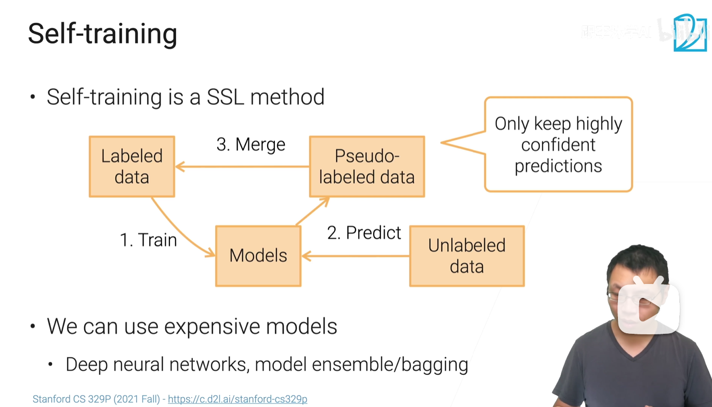
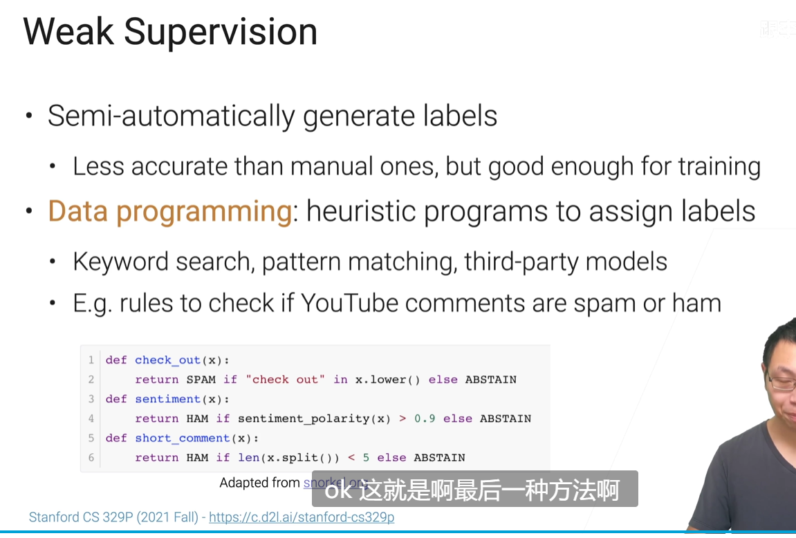

# 数据标注方法(labeling)
## 半监督学习中的自训练（self training）
对有label的数据训练一个模型用于无label数据的预测，然后将预测置信度较高的数据认为是有label的，然后再迭代，利用有label的数据再训练一个新的模型。  
可以使用模型融合(ensemble)或bagging，通常可以使用比较贵的模型

## 主动学习(active learning)
与self training类似，不同点在于将置信度低的预测样本交给人工(外包)去标注放入训练集中

## 弱监督(weak supervision)
设计启发式的规则(data programming), 半自动地产生一些置信度不那么高（但足以训练模型）的label
