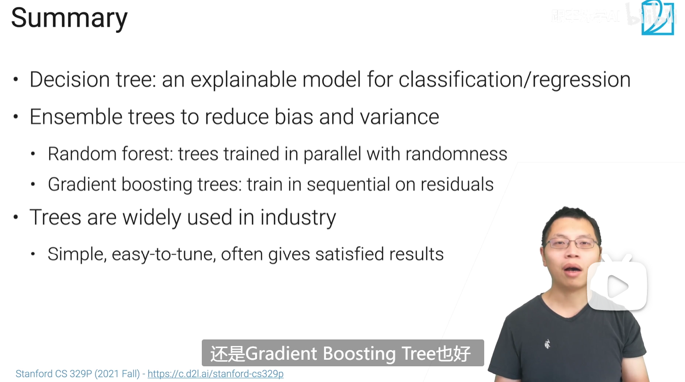

## 决策树
可用于分类和回归，通常会给出一个还不错的结果(baseline)
### Pros
可解释性，简单（不需要大量调参），对离散特征和连续特征都能做
### Cons
不稳定（对数据敏感），容易过拟合，不太容易并行计算
### 提升方法
random forest（bagging落袋法:对样本做放回的采样；对特征随机采样）并行地训练多棵树，最终结果取平均（对于回归问题）或投票（对于分类问题）；
对树做剪枝，减轻过拟合；
gradient boosting trees: 残差连接思想，顺序地训练多棵树

