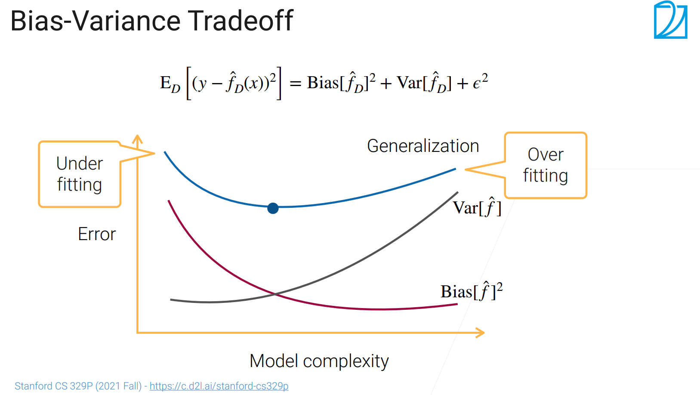
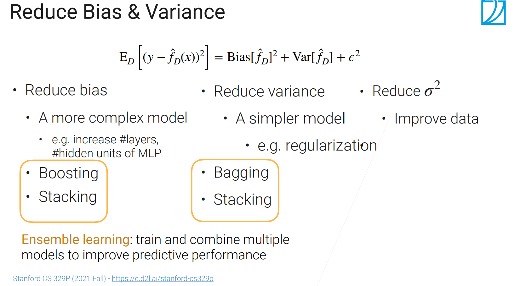

## 泛化误差的构成
generalized error( test error ) = bias + variance + noise
## bias 偏差
模型的预测值与真实标签的差距
## variance 方差
多个模型的预测值的方差（是否会抖动的很厉害）
## bias和variance的平衡
模型过于简单时, bias很大，没有学到什么东西（相当于underfitting）。当模型复杂度逐渐增加时，bias降低，variance增加。当模型过于复杂时，variance很大，变得overfitting。具体如图

## 降低泛化误差的方法

### 降低bias
* 使用一个更复杂的模型
* boosting
* stacking
### 降低variance
* 使用一个更简单的模型
* 正则化 regularization
* bagging
* stacking
### 降低noise
提升数据（数据清洗、预处理...）
## Ensemble learning 集成学习
训练多个模型来提升性能
* bagging
* boosting
* stacking
