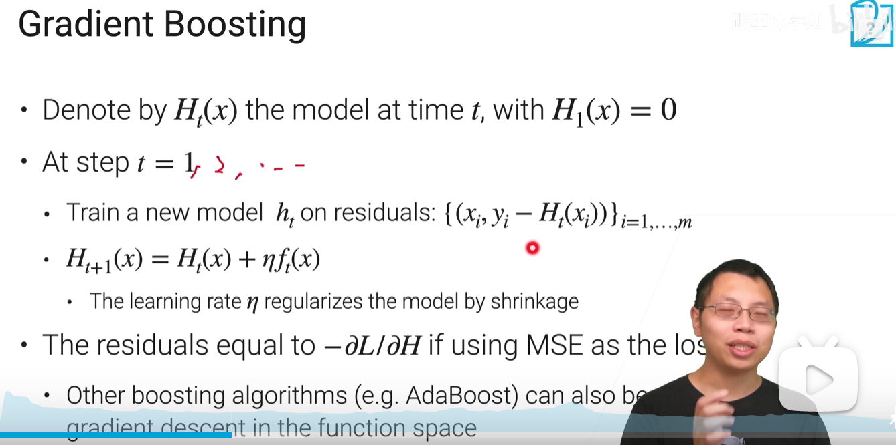
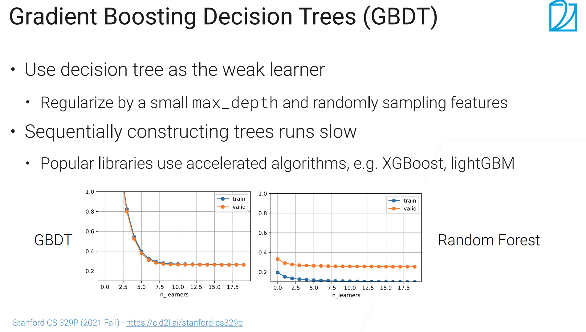

## boosting
顺序地训练多个简单模型，将几个弱模型(weak model)结合起来提升性能
## 原理
降低模型的bias，可能增加variance（导致overfitting）
## gradient boosting
boosting的一种，下一步的weak model拟合残差部分。aita是学习率，减少过拟合（可设为0.1,如果设成1将完全拟合残差，可能导致严重overfitting）

### GBDT
gradient boosting常用于决策树上（需要控制决策树的最大深度）
boosting与bagging的对比

### boosting的缺点
多个模型很难并行计算，不适用于复杂模型（多个大模型叠加导致overfitting）