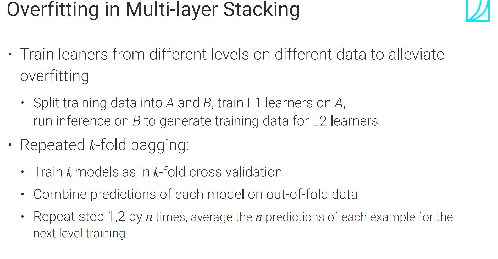
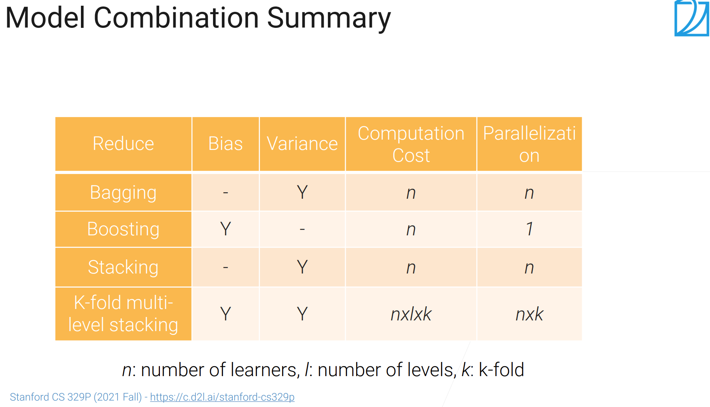

## stacking
* 在相同数据上训练不同种类的模型，将各个输出concat起来，再经过一个全连接得到最终输出。
比如最终的输出是一个标量，n个模型各自输出一个标量，拼成一个长为n的向量，再经过一个全连接投影到一个标量，得到最终输出。
* 可以降低variance
* diversity来自模型的多样性
## multi-layer stacking 
* 将第一层concat得到的输出作为第二层的输入（可以再concat上原始输入）
* 可以降低bias，但很容易overfitting
* 每一层可以用不同的模型，为了调参通常设置一样
* 性能提升不明显或计算很贵的模型通常不考虑做stacking
* 减轻过拟合的方法：数据集划分 or 重复的K折bagging

* 缺陷：很贵，但在层内可以并行
## bagging, boosting和stacking的对比
