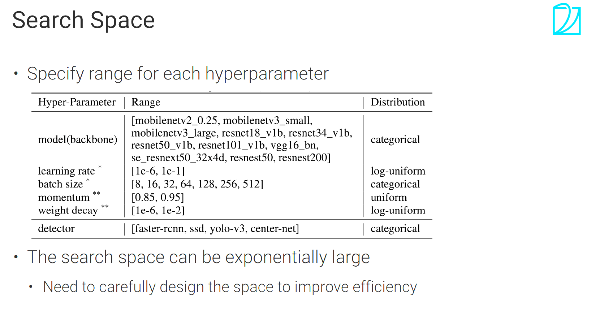
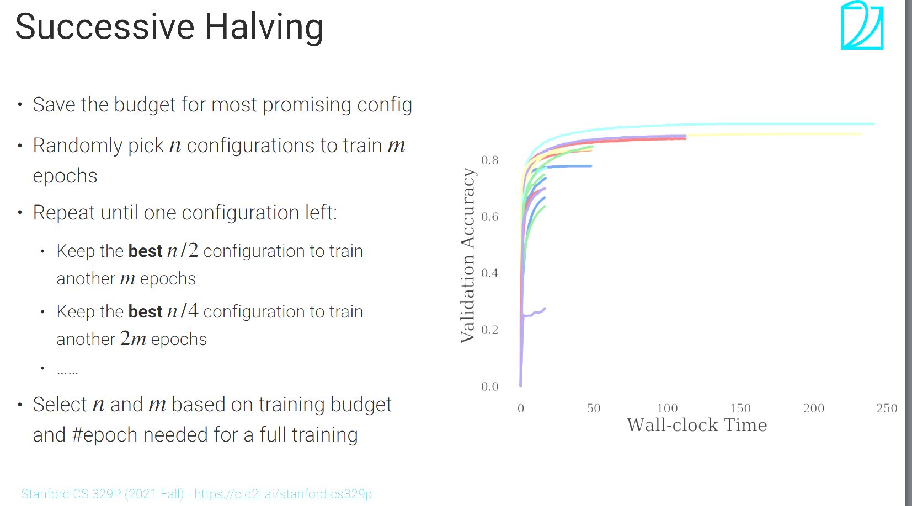
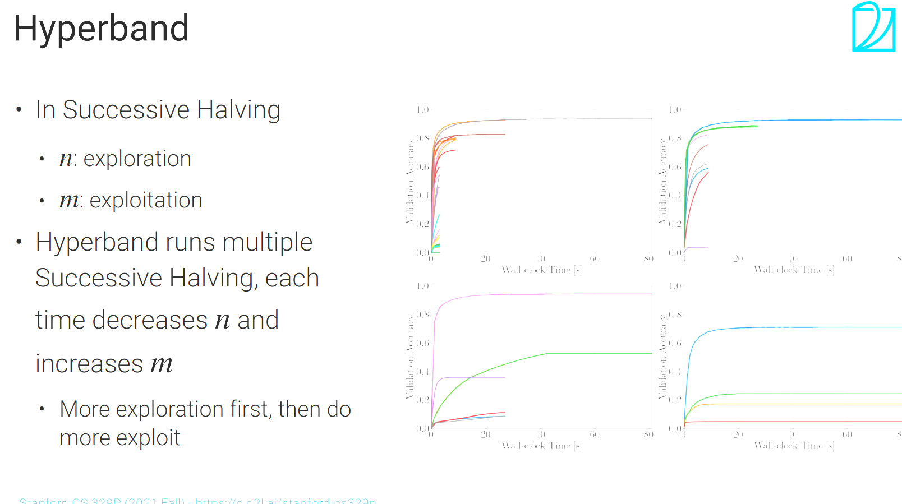

## Hyperparameter Optimization Algorithms
### 黑盒方法 
* 列出搜索空间，每次尝试都跑完
* grid search(暴力穷举)，能找到最优解但太贵了
* random search(在搜索空间中随机采样N个组合选择最佳结果)，通常是最推荐的
* BO 贝叶斯优化 学习从超参数到objective function的映射，效果不一定比random search好，而且更复杂，目前实际用的不多

## multi-fidelity
### 3种做法
* 在训练集的子集（采样）上训练
* 用同种的小模型
* 对于效果不好的超参数组合训练时做early stopping
### succesive halving(SH)
一种迭代算法
step0: 选择n种组合分别训练m个epoch
step1: step0中的组合丢掉一半，剩余的训练2m个epchch
...
直至剩下一种或两种组合

* 缺点：m和n不容易选择
### hyperband
跑多个SH，平衡m和n的选择(尝试多种m和n的组合)

### multi-fidelity需要平衡exploration和exploitation
比如SH中的n(exploration)和m(exploitation)